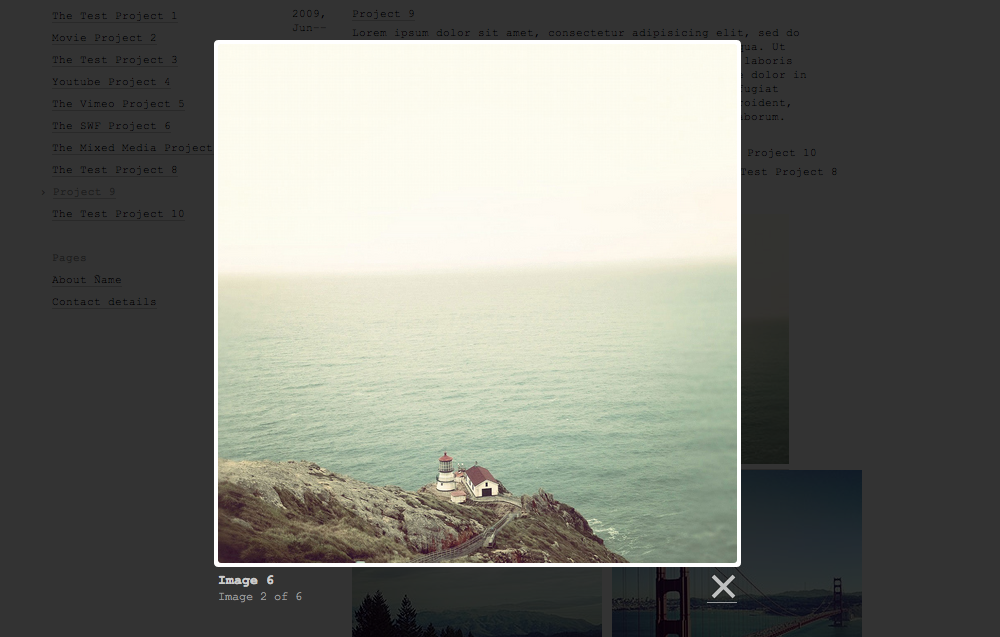

# Stacey - Template 2 with Lightbox support

This is the second stacey template using [Lightbox](http://lokeshdhakar.com/projects/lightbox2/) for image galleries.



## Installation

Replace the `content`, `public` & `templates` folders from the default stacey installation with the folders from this repo.

## Using the image gallery
Just add a folder called *_gallery* to one of your content folders. The folder must be structured like this:

* _gallery/
	* IMAGENAME1.jpg
	* IMAGENAME2.jpg
	* ...
	* IMAGENAME99.jpg
	* thumbs/
		* thumb_IMAGENAME1.jpg
		* thumb_IMAGENAME1.jpg
		* ...
		* thumb_IMAGENAME99.jpg

## Modifying an existing template to work with Lightbox
1. get [Lightbox](http://lokeshdhakar.com/projects/lightbox2/) (and donate)
2. copy the Lightbox source code to public/docs
3. referencing jquery, lightbox js and lightbox css to the template files (e.g. project.html)
	```
			<script src="@root_path/public/docs/lightbox/jquery-1.11.0.min.js"></script>
			<script src="@root_path/public/docs/lightbox/lightbox.min.js"></script>

			<link href="@root_path/public/docs/lightbox/lightbox.css" rel="stylesheet" />
	```
4. under templates/partials/assets add a new partial *gallery.html*
	```
		foreach $_gallery do

			<a href="@url" data-lightbox="gallery" data-title="@name">
				
			</a>

		endforeach
	```
5. modify the *media.html* partial by adding the new created gallery partial
	```
		<div id="media">
		  if $_gallery do
		    :gallery
		  endif

		  if $images do
		    :images
		  endif

		  if $video do
		    :video
		  endif

		  if $swf do
		    :swf
		  endif

		  if $html do
		    :html
		  endif
		</div>

	```

## Read More

See <http://staceyapp.com> for more detailed usage information.
Or the main stacey repo at <http://github.com/kolber/stacey>

## Copyright/License

Copyright (c) 2009 Anthony Kolber. See `LICENSE` for details.